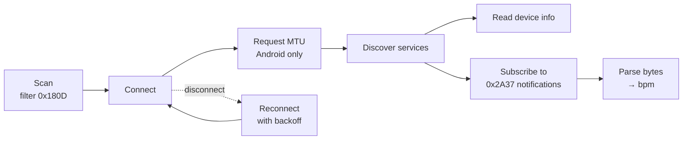
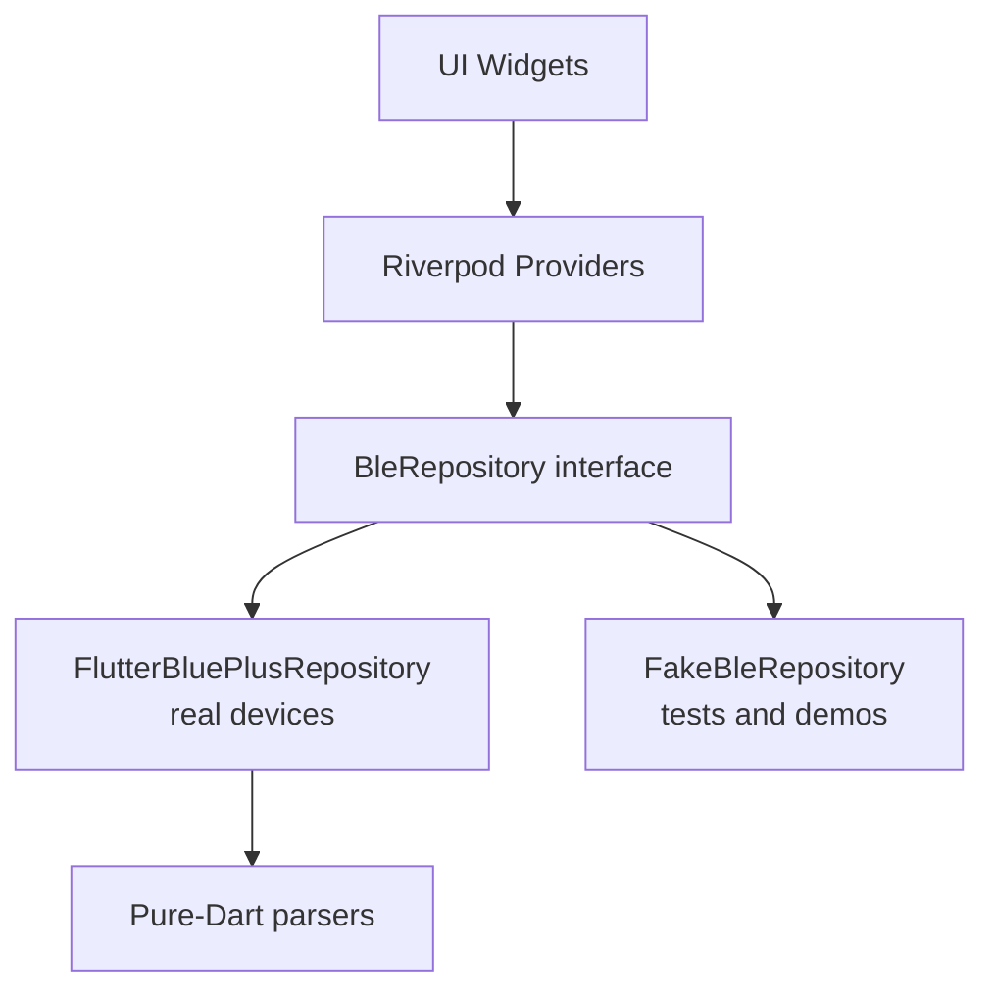

# PulseLink

A Flutter app that connects to Bluetooth Low Energy heart-rate sensors and streams live heart rate, built to production standards: clean architecture, resilient connections, and tested parsing logic.

PulseLink speaks the standard Bluetooth SIG **Heart Rate service (0x180D)**, so it works with any compliant device: chest straps, smartwatches that broadcast heart rate, an ESP32 running custom firmware, or a phone simulating a peripheral.

> **Status:** 🚧 In active development. See the [Roadmap](#roadmap) for progress.

---

## Features

- **Filtered scanning.** Discovers only devices advertising the Heart Rate service, with signal strength (RSSI) shown for each.
- **Connection management.** An explicit connection state machine with automatic reconnection using exponential backoff.
- **Live heart rate.** Subscribes to Heart Rate Measurement notifications and parses both 8-bit and 16-bit formats per the GATT specification.
- **Device info.** Reads body sensor location and battery level.
- **Resilience.** Handles Bluetooth being toggled off, permissions being revoked, devices going out of range, and peripherals powering down.
- **Background tracking.** Keeps the session alive with the screen off (an Android foreground service and the iOS `bluetooth-central` background mode).
- **Workout sessions.** Records heart-rate sessions locally for later review.

## How it works

PulseLink acts as the **BLE central / GATT client**. The sensor is the **peripheral / GATT server**.



### GATT profile used

| Service | UUID | Characteristic | UUID | Properties | Used for |
| --- | --- | --- | --- | --- | --- |
| Heart Rate | `0x180D` | Heart Rate Measurement | `0x2A37` | Notify | Live bpm stream |
| Heart Rate | `0x180D` | Body Sensor Location | `0x2A38` | Read | Sensor placement |
| Battery | `0x180F` | Battery Level | `0x2A19` | Read, Notify | Battery % |

### Parsing heart rate data

BLE transmits raw bytes. The first byte of a Heart Rate Measurement is a **flags** field. Bit 0 says whether the value that follows is a `uint8` or a little-endian `uint16`. PulseLink reads the flags rather than assuming a fixed layout, and the parser is fully unit-tested.

## Architecture



- **The UI never touches BLE types.** Widgets consume streams of app-level state, such as connection status and heart-rate readings.
- **The `BleRepository` interface** isolates the BLE package, so the implementation can be swapped (for example, to `flutter_reactive_ble`) without touching features.
- **A fake repository** drives widget tests and lets the app run without hardware.
- **Parsers are pure Dart** with no plugin dependency, so they run in fast, deterministic unit tests in CI.

### Project structure

```
lib/
├── main.dart
├── core/
│   ├── ble/
│   │   ├── ble_repository.dart                # Interface
│   │   ├── flutter_blue_plus_repository.dart  # Real implementation
│   │   ├── fake_ble_repository.dart           # Test/demo implementation
│   │   └── connection_state_machine.dart
│   ├── parsing/
│   │   └── heart_rate_parser.dart
│   └── permissions/
│       └── ble_permissions.dart
└── features/
    ├── scan/
    ├── monitor/
    └── sessions/
test/
├── parsing/
└── features/
```

## Tech stack

- **Flutter / Dart**
- **[flutter_blue_plus](https://pub.dev/packages/flutter_blue_plus)** for BLE
- **Riverpod** for state management and dependency injection
- **flutter_foreground_task** for Android background operation

## Getting started

### Prerequisites

- Flutter SDK 3.x
- A **physical** Android or iOS device. Emulators and simulators have no Bluetooth radio.
- A heart-rate peripheral. Any of these works:
  - A real BLE chest strap or watch that broadcasts heart rate
  - **LightBlue** (iOS/Android): create a virtual peripheral from the Heart Rate template
  - An ESP32 running a BLE heart-rate sketch

### Run

```bash
git clone https://github.com/Stanely254/pulselink.git
cd pulselink
flutter pub get
flutter run
```

### Platform configuration

**Android.** Uses the Android 12+ Bluetooth permissions (`BLUETOOTH_SCAN` with `neverForLocation`, and `BLUETOOTH_CONNECT`). The legacy permissions are capped at `maxSdkVersion="30"` for Android 11 and below. See `android/app/src/main/AndroidManifest.xml`.

**iOS.** Requires `NSBluetoothAlwaysUsageDescription` in `ios/Runner/Info.plist`. Background tracking uses the `bluetooth-central` background mode.

### Testing with LightBlue

1. Install LightBlue on a second phone.
2. Create a virtual peripheral using the **Heart Rate** template.
3. Launch PulseLink and tap scan. The virtual device should be the only result.
4. Connect, then edit the heart-rate value in LightBlue to watch it update live.

## Testing

```bash
flutter test
```

- **Unit tests** cover byte parsing (8-bit and 16-bit heart rate, flag handling, malformed payloads).
- **Widget tests** run against `FakeBleRepository` with scripted connection events and readings.
- **Manual hardware testing** follows a checklist covering out-of-range, Bluetooth toggled off, permissions revoked, and peripheral power loss.

Debugging tools used: **nRF Connect** to inspect GATT trees, and `flutter_blue_plus` verbose logging.

## Roadmap

- [ ] **M1: Find.** Filtered scan for the Heart Rate service
- [ ] **M2: Connect and read.** Service discovery, body sensor location, battery level
- [ ] **M3: Go live.** Heart-rate notifications, tested parser, live chart
- [ ] **M4: Survive.** State machine, reconnection with backoff, background mode, saved sessions
- [ ] **M5: Talk back.** Custom ESP32 service: threshold writes, MTU negotiation, chunked firmware-update simulation, bonding
- [ ] **Native twin.** Milestones 1–3 reimplemented in Kotlin on raw Android BLE APIs

## Engineering notes

A running log of real issues hit during development: root cause, fix, and what was learned. Platform quirks found on specific Android manufacturers and OS versions are recorded here.

<!-- Example entry format:
### Reconnect fails after device power-cycle
**Symptom:** ...
**Root cause:** ...
**Fix:** ...
-->

## Author

**Stanley Muyuga**, Senior Mobile Engineer (Flutter and native Android)
[GitHub](https://github.com/Stanely254) · [LinkedIn](https://linkedin.com/in/stanley-muyuga) · [Medium](https://medium.com/@muyuga)

## License

MIT
